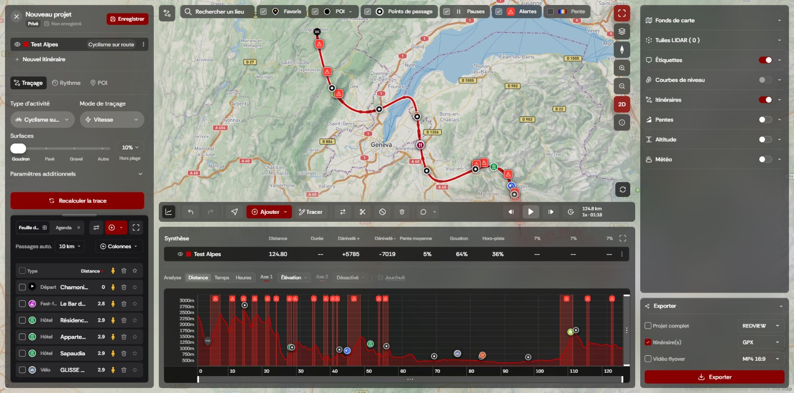
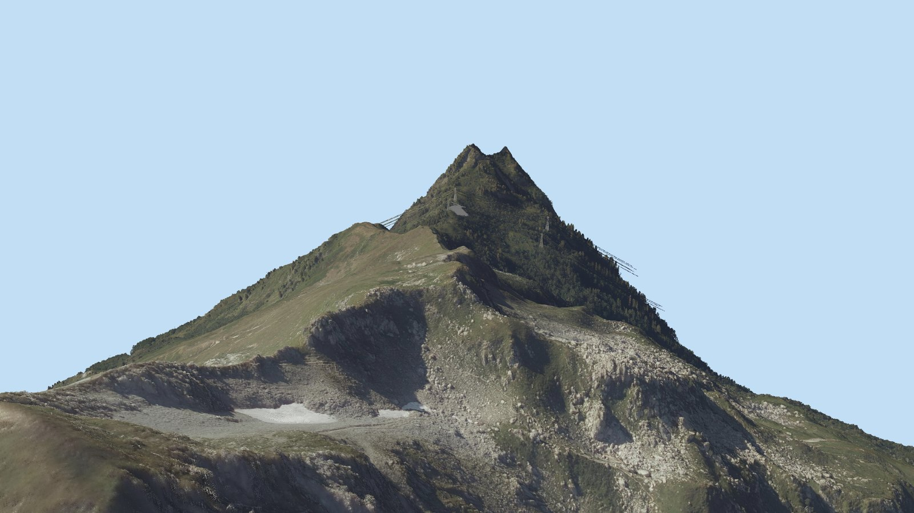
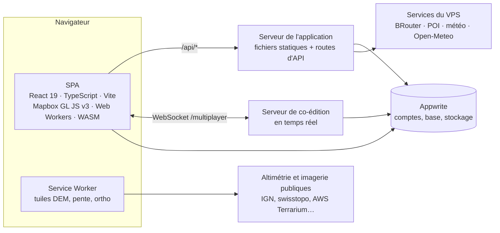

<div align="center">

<picture>
  <source media="(prefers-color-scheme: dark)" srcset="public/brand/redview-logo.svg">
  
</picture>

### Préparer et analyser de longs parcours sur un relief 3D haute résolution

Planification d'itinéraires et analyse du terrain pour l'ultra-cyclisme, le bikepacking et le trail,
sur un relief à 40 cm et des nuages de points LiDAR à 20 cm.

[](https://github.com/RedView-lab/RedView-App/actions/workflows/ci.yml)


[**Ouvrir l'application**](https://app.redview.tech) · [Documentation](docs/README.md) · [Contribuer](CONTRIBUTING.md) · [Sécurité](SECURITY.md)

</div>

<br>

<p align="center">
  
</p>

## Sommaire

- [Ce que fait RedView](#ce-que-fait-redview)
- [Architecture](#architecture)
- [Technologies](#technologies)
- [Organisation du dépôt](#organisation-du-dépôt)
- [Démarrer](#démarrer)
- [Commandes courantes](#commandes-courantes)
- [Qualité](#qualité)
- [Production et exploitation](#production-et-exploitation)
- [Documentation](#documentation)

## Ce que fait RedView

| | |
|---|---|
| **Routage** | Itinéraires calculés par [BRouter](https://github.com/abrensch/brouter) avec un profil produit à partir des réglages du cycliste, à chaque changement. Une modification locale ne reroute qu'une fenêtre autour d'elle, et un tracé enregistré ne contient jamais de ligne droite. |
| **Prédiction du temps en mouvement** | Un moteur de physique et de comportement écrit en Rust et compilé en WebAssembly : puissance selon la pente, virages, descentes, surface, fatigue. Il est calibré sur les fichiers FIT du cycliste ; les pauses et l'horaire sont planifiés par-dessus. |
| **Analyse du terrain** | Pentes, altitude, météo le long du parcours, hauteur de neige (modèle de prévision + stations + bulletins d'avalanche, redistribuée par le vent, la gravité et la forêt), ensoleillement et ombres, exposition au terrain avalancheux (AutoATES). |
| **Visualiseur LiDAR** | Tuiles LiDAR nationales (France, Suisse, Pays-Bas, Flandre, Japon, Nouvelle-Zélande) chargées en flux depuis le stockage du navigateur (OPFS). WebGPU, avec un repli WebGL 2 pour Linux. Outils de mesure et édition d'itinéraire en 3D. |
| **Co-édition en temps réel** | Projets partagés à la Figma : présence, suivi de la vue d'un autre éditeur, commentaires épinglés sur la carte et dans le visualiseur LiDAR. |
| **Exports** | GPX, KML, parcours FIT, un fichier de projet `.redview` autonome, et une vidéo de survol (MP4) rendue hors ligne. |

<p align="center">
  
</p>

## Architecture



Quatre éléments déployables, tous auto-hébergés :

| Élément | Code | Rôle |
|---|---|---|
| **Frontend** | [`src/`](src) | Deux entrées Vite : `index.html` (l'application) et `viewer.html` (le visualiseur LiDAR). Un dossier par domaine dans `src/features/`, le code transverse dans `src/shared/`. |
| **Serveur de l'application** | [`api/`](api), [`server.mjs`](server.mjs), [`server/lib/`](server/lib) | Gestionnaires de routes exécutés par `server.mjs` en production (bundle esbuild, ressources précompressées, CSP, limitation de débit, journaux structurés) et par un plugin Vite en développement. |
| **Serveur de co-édition** | [`server/multiplayer/`](server/multiplayer), [`src/features/collab/`](src/features/collab) | Modèle de document dont le serveur fait autorité, journal et points de reprise dans Appwrite, simulateur déterministe dans la suite de tests. |
| **Services du VPS** | [`server/poi-server/`](server/poi-server), [`server/weather-daemon/`](server/weather-daemon), [`server/vps/`](server/vps) | BRouter, recherche de POI et météo derrière nginx, joignables uniquement via l'API. La configuration de l'hôte est versionnée. |

Les calculs lourds restent hors du fil principal : Web Workers pour les tuiles,
l'analyse des FIT, la compression des données et le décodage LiDAR, et deux crates
Rust compilées en WebAssembly ([`vendor/redviewalgo`](vendor/redviewalgo) : moteur
d'allure ; [`vendor/redviewlaz`](vendor/redviewlaz) : décodeur LAZ).

## Technologies

| Couche | Technologies |
|---|---|
| Frontend | React 19, TypeScript (strict), Vite, Mapbox GL JS v3, TanStack Query, WebGPU et WebGL 2, Web Workers |
| Calcul | Rust → WebAssembly (wasm-bindgen), pipeline de tuiles dans un Service Worker |
| Serveurs | Node.js 22, bundles esbuild, `ws` pour le temps réel, Fastify + SQLite R\*Tree (POI), Python (ingestion météo) |
| Données et comptes | Appwrite (comptes, base de données, stockage de fichiers) |
| Routage et météo | BRouter, Open-Meteo auto-hébergé (AROME / ARPEGE de Météo-France) |
| Infrastructure | Docker sur Coolify, VPS Oracle Cloud, nginx, GitHub Actions |
| Observabilité | GlitchTip (erreurs, protocole Sentry), journaux pino, Umami (statistiques anonymes, servi depuis notre propre domaine) |
| Qualité | Vitest, Playwright, ESLint, knip, madge |

## Organisation du dépôt

```text
.
├── src/                    Frontend (React + TypeScript)
│   ├── features/           Un dossier par domaine : map3d, itineraryPanel, lidar, collab, …
│   ├── shared/             composants, hooks, lib, services, styles, i18n, test
│   └── pages/Dashboard/    Racine de composition de l'éditeur
├── api/                    Gestionnaires de routes HTTP (api/<nom>.ts → /api/<nom>), code partagé dans _lib/
├── server/                 Modules serveur partagés (lib/), serveur temps réel, services du VPS, config de l'hôte
├── public/                 Ressources statiques et Service Worker des tuiles (sw-dem.js + sw-dem/)
├── vendor/                 Crates Rust compilées en WebAssembly (sorties commitées)
├── scripts/                Outils de build, contrôle qualité, mise en production et exploitation
├── script-test-bench/      Bancs de performance, parcours de bout en bout et suites de régression
├── test/                   Tests du code qui ne peut pas héberger les siens (Service Worker)
├── docs/                   Notes d'architecture, procédures, audits datés
├── server.mjs              Point d'entrée de production (fichiers statiques + API)
└── CLAUDE.md               Référence technique détaillée
```

Chaque dossier de premier niveau qui a plus d'un rôle a sa propre carte :
[`server/`](server/README.md) · [`scripts/`](scripts/README.md) · [`script-test-bench/`](script-test-bench/README.md) ·
[`docs/`](docs/README.md). Les conventions à l'intérieur de `src/` sont dans
[`docs/architecture/structure.md`](docs/architecture/structure.md).

## Démarrer

**Prérequis :** Node.js 22 (voir [`.nvmrc`](.nvmrc)) et npm.
En option : un environnement Java et un dépôt `../redview-brouter` voisin pour un
BRouter local ; la chaîne Rust seulement pour recompiler les crates WebAssembly,
dont les sorties sont commitées.

```bash
npm ci
cp .env.example .env   # valeurs Appwrite, Mapbox et des services amont
npm run dev            # Vite + routes d'API + serveur temps réel + services locaux
```

`npm run dev` démarre BRouter et le serveur de POI en local quand ils sont
disponibles, et ouvre un tunnel SSH vers le VPS pour les services amont qui ne
répondent qu'aux requêtes locales (voir [`.env.example`](.env.example)).

## Commandes courantes

| Commande | Rôle |
|---|---|
| `npm run dev` | Serveur de développement : application, routes d'API, serveur temps réel, services locaux |
| `npm run build` | Vérification des types et build de production du frontend |
| `npm start` | Serveur de production depuis les sources |
| `npm run check` | Porte qualité, en parallèle : types, ESLint, tests unitaires, knip, cycles d'import, traductions |
| `npm run check:full` | Porte + build de production, budget du bundle, serveurs bundlés réellement démarrés, parcours de bout en bout, suites de régression — ce que lance la CI |
| `npm test` | Tests unitaires (Vitest) |
| `npm run bench` | Suites de performance avec seuils ([`script-test-bench/`](script-test-bench/README.md)) |
| `npm run deploy` | Met en production le travail commité, après le contrôle complet |

Toutes les commandes, avec le rôle de chaque banc, sont listées dans [`CLAUDE.md`](CLAUDE.md).

## Qualité

- **Types.** TypeScript strict (`noUnused*`, `verbatimModuleSyntax`, `erasableSyntaxOnly`)
  pour l'application, l'API, les serveurs et les bancs.
- **Tests.** Tests unitaires à côté du code qu'ils couvrent (`foo.ts` → `foo.test.ts`),
  frontières de sécurité, persistance et calculs de routage d'abord ; tests de
  composants pour les barres d'outils et onglets principaux. Tests serveur dans
  `server/lib/__tests__/` et `server/multiplayer/`, tests d'API dans `api/_lib/__tests__/`.
- **Suites de régression sur données réelles.** Qualité du routage (~660 scénarios),
  justesse de l'allure face à de vraies sorties, co-édition sous charge et à travers
  les redémarrages du serveur, chargement du tableau de bord sur réseaux bridés,
  visualiseur LiDAR dans Chromium et Firefox (WebKit en option), mise en page sur 15 tailles d'écran.
- **Analyse statique.** Un cliquet ESLint (aucune nouvelle erreur ne peut entrer),
  knip (aucun fichier, dépendance ou export inutilisé), madge (aucun cycle d'import
  à l'exécution), un budget de 300 Kio compressés (brotli) sur le chargement initial, 100 % des textes
  d'interface traduits (FR / EN).
- **CI.** GitHub Actions lance `check:full` et la suite du visualiseur LiDAR sous Linux
  à chaque push et pull request vers `main`.

## Production et exploitation

La production tourne dans Docker sur Coolify, sur un VPS Oracle Cloud derrière le
nginx de l'hôte. `npm run deploy` refuse un arbre de travail modifié, lance
`check:full`, vérifie le schéma de la base de production, pousse, puis déclenche le
déploiement.

- **Erreurs** : envoyées à un GlitchTip auto-hébergé, depuis le frontend et les
  serveurs, avec des source maps cachées envoyées au build ; les violations de CSP y
  sont aussi rapportées.
- **Journaux** : une ligne JSON structurée par requête, avec un identifiant de requête
  propagé jusqu'au service de POI.
- **Sauvegardes** : instantanés restic chiffrés stockés hors site, avec un exercice de
  restauration automatique chaque semaine — voir [`server/vps/backup/`](server/vps/backup/README.md).
- **Sécurité** : Content-Security-Policy stricte (sans `unsafe-eval`), contrôle des
  droits côté serveur pour les projets partagés, caches bornés en octets, limitation
  de débit — voir [`SECURITY.md`](SECURITY.md).

## Documentation

| Document | Pour |
|---|---|
| [`CLAUDE.md`](CLAUDE.md) | La référence technique détaillée : chaque commande, l'architecture, les règles sur lesquelles repose chaque sous-système |
| [`docs/`](docs/README.md) | Notes d'architecture, procédures d'exploitation et audits datés |
| [`CONTRIBUTING.md`](CONTRIBUTING.md) | Comment un changement arrive dans `main` : installation, contrôle qualité, tests, conventions de commit |
| [`SECURITY.md`](SECURITY.md) | Signaler une vulnérabilité |

## Licence

Projet privé. Aucune licence n'est accordée pour utiliser, copier ou distribuer ce code.
