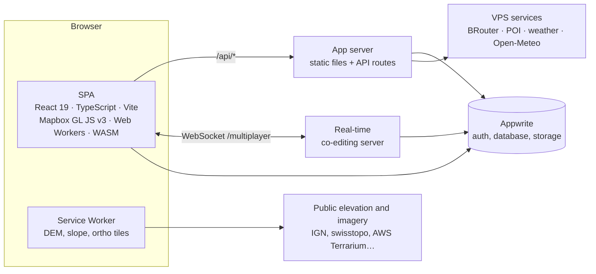

<div align="center">

<picture>
  <source media="(prefers-color-scheme: dark)" srcset="public/brand/redview-logo.svg">
  
</picture>

### Plan, analyse and ride long routes on high-resolution 3D terrain

Route planning and terrain analysis for ultra-cycling, bikepacking and trail running,
on 40 cm relief and 20 cm LiDAR point clouds.

[](https://github.com/RedView-lab/RedView-App/actions/workflows/ci.yml)


[**Open the app**](https://app.redview.tech) · [Documentation](docs/README.md) · [Contributing](CONTRIBUTING.md) · [Security](SECURITY.md)

</div>

<br>

<p align="center">
  
</p>

## Contents

- [What RedView does](#what-redview-does)
- [Architecture](#architecture)
- [Tech stack](#tech-stack)
- [Repository layout](#repository-layout)
- [Getting started](#getting-started)
- [Everyday commands](#everyday-commands)
- [Quality](#quality)
- [Production and operations](#production-and-operations)
- [Documentation](#documentation)

## What RedView does

| | |
|---|---|
| **Routing** | Routes on [BRouter](https://github.com/abrensch/brouter) with a profile generated from the rider's settings on every change. A local edit reroutes only a window around it, and a stored route never contains a straight line. |
| **Moving-time prediction** | A physics and behaviour engine written in Rust and compiled to WebAssembly: power by gradient, cornering, descents, surface, fatigue. It is calibrated on the rider's own FIT files; pauses and the schedule are planned on top of it. |
| **Terrain analysis** | Slopes, altitude, weather along the route, snow depth (forecast model + stations + avalanche bulletins, redistributed by wind, gravity and forest), sunlight and shadows, avalanche terrain exposure (AutoATES). |
| **LiDAR viewer** | National LiDAR tiles (France, Switzerland, Netherlands, Flanders, Japan, New Zealand) streamed from the browser's storage. WebGPU, with a WebGL 2 fallback for Linux. Measurement tools and route editing in 3D. |
| **Real-time co-editing** | Figma-style shared projects: presence, following another editor's view, comments pinned on the map and in the LiDAR viewer. |
| **Exports** | GPX, KML, FIT course, a self-contained `.redview` project file, and a flyover video (MP4) rendered offline. |

<p align="center">
  
</p>

## Architecture



Four deployable pieces, all self-hosted:

| Piece | Code | Role |
|---|---|---|
| **Frontend** | [`src/`](src) | Two Vite entries: `index.html` (the app) and `viewer.html` (the LiDAR viewer). One folder per domain in `src/features/`, cross-cutting code in `src/shared/`. |
| **App server** | [`api/`](api), [`server.mjs`](server.mjs), [`server/lib/`](server/lib) | Route handlers run by `server.mjs` in production (esbuild bundle, precompressed assets, CSP, rate limits, structured logs) and by a Vite plugin in development. |
| **Co-editing server** | [`server/multiplayer/`](server/multiplayer), [`src/features/collab/`](src/features/collab) | Server-authoritative document model, journal and checkpoints in Appwrite, a deterministic simulator in the test suite. |
| **VPS services** | [`server/poi-server/`](server/poi-server), [`server/weather-daemon/`](server/weather-daemon), [`server/vps/`](server/vps) | BRouter, POI search and weather behind nginx, reached only through the API. Host configuration is versioned. |

Heavy computation stays off the main thread: Web Workers for tiles, FIT parsing,
payload compression and LiDAR decoding, and two Rust crates compiled to
WebAssembly ([`vendor/redviewalgo`](vendor/redviewalgo): pace engine;
[`vendor/redviewlaz`](vendor/redviewlaz): LAZ decoder).

## Tech stack

| Layer | Technologies |
|---|---|
| Frontend | React 19, TypeScript (strict), Vite, Mapbox GL JS v3, TanStack Query, WebGPU and WebGL 2, Web Workers |
| Compute | Rust → WebAssembly (wasm-bindgen), Service Worker tile pipeline |
| Servers | Node.js 22, esbuild bundles, `ws` for real-time, Fastify + SQLite R\*Tree (POI), Python (weather ingest) |
| Data and auth | Appwrite (accounts, database, file storage) |
| Routing and weather | BRouter, self-hosted Open-Meteo (Météo-France AROME / ARPEGE) |
| Infrastructure | Docker on Coolify, Oracle Cloud VPS, nginx, GitHub Actions |
| Observability | GlitchTip (errors, Sentry protocol), pino logs, Umami (anonymous, first-party analytics) |
| Quality | Vitest, Playwright, ESLint, knip, madge |

## Repository layout

```text
.
├── src/                    Frontend (React + TypeScript)
│   ├── features/           One folder per domain: map3d, itineraryPanel, lidar, collab, …
│   ├── shared/             components, hooks, lib, services, styles, i18n, test
│   └── pages/Dashboard/    Composition root of the editor
├── api/                    HTTP route handlers (api/<name>.ts → /api/<name>), shared code in _lib/
├── server/                 Shared server modules (lib/), real-time server, VPS services, host config
├── public/                 Static assets and the tile Service Worker (sw-dem.js + sw-dem/)
├── vendor/                 Rust crates compiled to WebAssembly (outputs committed)
├── scripts/                Build, quality gate, release and operations tooling
├── script-test-bench/      Benchmarks, end-to-end journeys and regression suites
├── test/                   Tests of code that cannot host its own (Service Worker)
├── docs/                   Architecture notes, runbooks, dated audits
├── server.mjs              Production entry point (static files + API)
└── CLAUDE.md               Detailed technical reference
```

Each top-level folder with more than one role has its own map:
[`server/`](server/README.md) · [`scripts/`](scripts/README.md) · [`script-test-bench/`](script-test-bench/README.md) ·
[`docs/`](docs/README.md). Conventions inside `src/` are in
[`docs/architecture/structure.md`](docs/architecture/structure.md).

## Getting started

**Requirements:** Node.js 22 (see [`.nvmrc`](.nvmrc)) and npm.
Optional: a Java runtime and a sibling `../redview-brouter` checkout for a local
BRouter; the Rust toolchain only to rebuild the WebAssembly crates, whose outputs
are committed.

```bash
npm ci
cp .env.example .env   # Appwrite, Mapbox and upstream values
npm run dev            # Vite + API routes + real-time server + local services
```

`npm run dev` starts BRouter and the POI server locally when they are available,
and opens an SSH tunnel to the VPS for the upstreams that only answer local
requests (see [`.env.example`](.env.example)).

## Everyday commands

| Command | What it does |
|---|---|
| `npm run dev` | Development server: app, API routes, real-time server, local services |
| `npm run build` | Type-check and production build of the frontend |
| `npm start` | Production server from sources |
| `npm run check` | Quality gate, in parallel: types, ESLint, unit tests, knip, import cycles |
| `npm run check:full` | Gate + production build, bundle budget, bundled servers started for real, end-to-end journey, regression suites — what CI runs |
| `npm test` | Unit tests (Vitest) |
| `npm run bench` | Performance suites with thresholds ([`script-test-bench/`](script-test-bench/README.md)) |
| `npm run deploy` | Deploy committed work to production, after the full gate |

Every command, with the purpose of each benchmark, is listed in [`CLAUDE.md`](CLAUDE.md).

## Quality

- **Types.** Strict TypeScript (`noUnused*`, `verbatimModuleSyntax`, `erasableSyntaxOnly`)
  for the app, the API, the servers and the benchmarks.
- **Tests.** Unit tests next to the code they cover (`foo.ts` → `foo.test.ts`),
  security boundaries, persistence and routing math first. Server tests in
  `server/lib/__tests__/` and `server/multiplayer/`, API tests in `api/_lib/__tests__/`.
- **Regression suites on real data.** Routing quality (~660 scenarios), pace
  accuracy against real rides, co-editing under load and across server restarts,
  dashboard load on throttled networks, the LiDAR viewer in Chromium, Firefox and
  WebKit, layout on 15 screen sizes.
- **Static analysis.** An ESLint ratchet (no new error can be added), knip (no
  unused file, dependency or export), madge (no runtime import cycle), a 300 KiB
  budget on the initial load.
- **CI.** GitHub Actions runs `check:full` and the LiDAR viewer suite on Linux for
  every push and pull request to `main`.

## Production and operations

Production runs in Docker on Coolify, on an Oracle Cloud VPS behind the host's
nginx. `npm run deploy` refuses a dirty tree, runs `check:full`, checks the
production database schema, pushes, then triggers the deployment.

- **Errors** go to a self-hosted GlitchTip, from the frontend and the servers, with
  hidden source maps uploaded at build time; CSP violations are reported there too.
- **Logs** are one structured JSON line per request, with a request id propagated
  to the POI service.
- **Backups** are encrypted restic snapshots stored off-site, with a weekly
  automated restore drill — see [`server/vps/backup/`](server/vps/backup/README.md).
- **Security**: strict Content-Security-Policy (no `unsafe-eval`), server-side
  rights checks for shared projects, byte-bounded caches, rate limits — see
  [`SECURITY.md`](SECURITY.md).

## Documentation

| Document | For |
|---|---|
| [`CLAUDE.md`](CLAUDE.md) | The detailed technical reference: every command, the architecture, the rules each subsystem relies on |
| [`docs/`](docs/README.md) | Architecture notes, runbooks and dated audits |
| [`CONTRIBUTING.md`](CONTRIBUTING.md) | How a change gets into `main`: setup, gate, tests, commit conventions |
| [`SECURITY.md`](SECURITY.md) | Reporting a vulnerability |

## License

Private project. No license is granted to use, copy or distribute this code.
