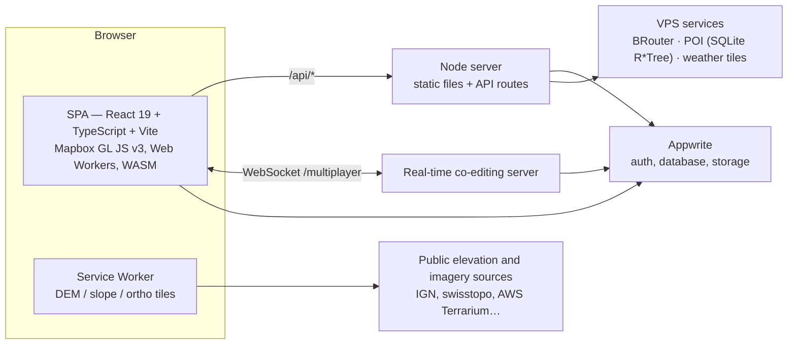

# RedView

3D route planning and analysis for ultra-cycling, bikepacking and trail running,
on high-resolution terrain (40 cm relief, 20 cm LiDAR point clouds).

**App:** [app.redview.tech](https://app.redview.tech) · **Site:** [redview.tech](https://redview.tech)

- **Routing** on BRouter with a profile generated from the rider's settings on every
  change; local edits reroute only a window around the edit, and a stored route
  never contains a straight line.
- **Moving-time prediction** by a physics and behaviour engine in Rust/WebAssembly
  (power by gradient, cornering, descents, surface, fatigue), calibrated on the
  rider's own FIT files; pauses and schedule are planned on top of it.
- **Terrain analysis**: slopes, altitude, weather along the route, snow depth
  (AROME + stations + avalanche bulletins, redistributed by wind, gravity and forest),
  sunlight and shadows, avalanche terrain exposure (AutoATES).
- **LiDAR viewer**: national LiDAR tiles (France, Switzerland, Netherlands, Flanders,
  Japan, New Zealand…) streamed from the browser's storage, WebGPU with a WebGL 2
  fallback, measurement tools and route editing in 3D.
- **Real-time co-editing**, Figma-style: shared projects, presence, following
  another editor's view, comments on the map.
- Exports: GPX, FIT course, a self-contained `.redview` project file, and a
  flyover video (MP4) rendered offline.

## Architecture



Four deployable pieces, all self-hosted:

| Piece | Code | Notes |
|---|---|---|
| Frontend | `src/` | Two entries: `index.html` (app) and `viewer.html` (LiDAR viewer). Feature-sliced: `src/features/*` with a public `index.ts`, cross-cutting code in `src/shared/`. |
| API + static server | `api/*.ts`, `server.mjs`, `server/lib/` | Vercel-style handlers run by `server.mjs` in production (bundled with esbuild, precompressed assets, CSP, rate limits, request logs) and by a Vite plugin in development. |
| Co-editing server | `server/multiplayer/`, `src/features/collab/` | Server-authoritative document model, journal + checkpoints in Appwrite, deterministic simulator in the test suite. |
| VPS services | `server/poi-server/`, `server/weather-daemon/`, `server/vps/` | BRouter, POI and weather behind nginx, reached only through the API proxies. Host configuration is versioned in `server/vps/`. |

Heavy computation stays off the main thread: Web Workers for tiles, FIT parsing,
payload compression and LiDAR decoding, two Rust crates compiled to WebAssembly
(`vendor/redviewalgo`: prediction engine; `vendor/redviewlaz`: LAZ decoder).

## Getting started

Requirements: Node.js 22, npm. Optional: a Java runtime and a sibling `../redview-brouter`
checkout for a local BRouter; the Rust toolchain only to rebuild the WebAssembly
crates (their outputs are committed).

```bash
npm ci
cp .env.example .env   # fill in the Appwrite, Mapbox and upstream values
npm run dev            # Vite dev server + API routes + local services
```

`npm run dev` starts BRouter and the POI server locally when they are available,
and opens an SSH tunnel to the VPS for the upstreams that only answer local
requests (see `.env.example`).

## Commands

| Command | What it does |
|---|---|
| `npm run dev` | Development server (app, API routes, co-editing server, local services) |
| `npm run build` | Type-check and production build of the frontend |
| `npm run check` | Quality gate, in parallel: types (`tsc -b`), ESLint, Vitest, knip, import cycles |
| `npm run check:full` | Gate + production build, bundle budget, bundled servers started for real, offline regression suites — what CI runs |
| `npm test` | Unit tests (Vitest) |
| `npm run bench` | Benchmark and regression suite (`script-test-bench/`) |
| `npm start` | Production server from sources |

The full list, with the purpose of each benchmark, is in [`CLAUDE.md`](CLAUDE.md).

## Quality

- **Types**: strict TypeScript (`noUnused*`, `verbatimModuleSyntax`, `erasableSyntaxOnly`),
  checked for the app, the API, the servers and the benchmarks.
- **Tests**: unit tests next to the code they cover (`foo.ts` → `foo.test.ts`);
  server and API tests in `server/lib/__tests__`, `server/multiplayer` and `api/_lib/__tests__`; Service Worker tests in `test/service-worker`.
  Business rules, security boundaries, persistence and routing math are covered first.
- **Regression benchmarks** on real data in `script-test-bench/`: routing quality
  (~660 scenarios), prediction accuracy, co-editing under load and across server restarts,
  dashboard load on throttled networks, LiDAR rendering in Chromium, Firefox and WebKit,
  layout on 15 screen sizes.
- **Static analysis**: ESLint with a ratchet (no new error can be added), knip
  (unused files and dependencies), madge (no runtime import cycle), a 300 KiB
  budget on the initial load.
- **CI** (GitHub Actions) runs `check:full` and the LiDAR viewer suite on Linux
  for every push and pull request to `main`.

## Deployment and operations

Production runs on Coolify (Docker) on an Oracle Cloud VPS, behind the host's nginx.
The deploy script runs `check:full` first and stops on any failure.

- **Errors**: self-hosted GlitchTip (Sentry protocol), frontend and servers, with
  hidden source maps uploaded at build time; CSP violations are reported there too.
- **Logs**: one structured JSON line per request (pino), with a request id
  propagated to the POI service.
- **Backups**: encrypted restic snapshots off-site, with a weekly automated restore
  drill — see [`server/vps/backup/README.md`](server/vps/backup/README.md).
- **Security**: strict Content-Security-Policy (no `unsafe-eval`), server-side
  rights checks for shared projects, bounded in-memory caches, rate limits.

## Documentation

- [`CLAUDE.md`](CLAUDE.md) — the working reference: commands, architecture, conventions.
- [`docs/`](docs/README.md) — architecture notes, runbooks and dated audits.
- [`CONTRIBUTING.md`](CONTRIBUTING.md) — repository layout, how a change gets into `main`, commit conventions.
- [`SECURITY.md`](SECURITY.md) — reporting a vulnerability.
- Folder maps: [`server/`](server/README.md), [`scripts/`](scripts/README.md), [`script-test-bench/`](script-test-bench/README.md).

## License

Private project: no license is granted.
