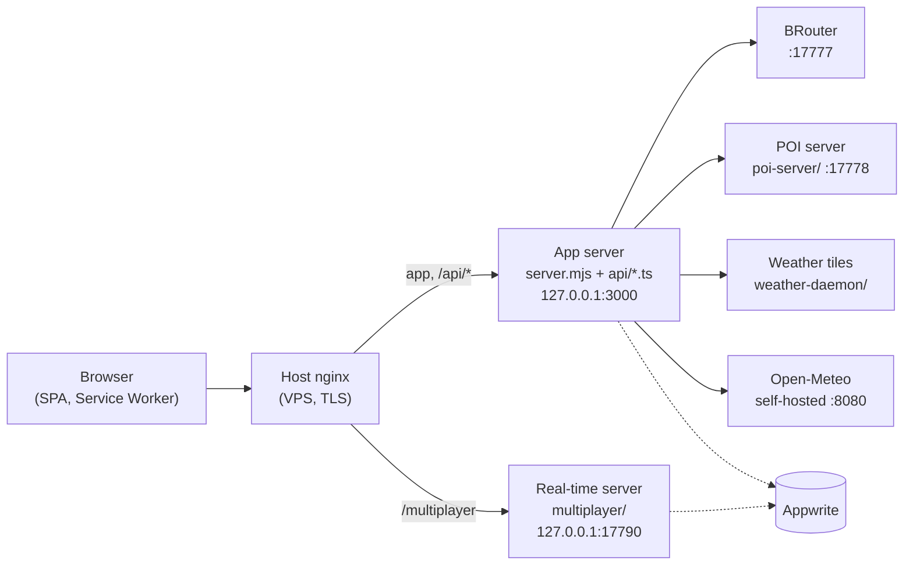

# server/

[← Repository](../README.md) · [Docs index](../docs/README.md)

All server-side code except the HTTP route handlers, which live in [`api/`](../api).
That covers the modules shared by both HTTP adapters, the real-time co-editing
server, the services that run on the VPS, and the VPS host configuration.

## How the pieces run

- **Production:** [`../server.mjs`](../server.mjs) serves `dist/` and the `api/*.ts` handlers.
  In the image it runs as an esbuild bundle in `dist-server/`.
- **Development:** the same handlers run inside Vite (`redviewDevApiPlugin` in
  [`vite.config.ts`](../vite.config.ts)).
- Both adapters share the modules of [`lib/`](lib). A rule that applies to both
  is written once there, never in each adapter.

## Folders

| Folder | What it is | Where it runs |
|---|---|---|
| [`lib/`](lib) | Modules shared by the two HTTP adapters, the API handlers and the real-time server. See [`lib/` modules](#lib-modules) below. Tests are in [`lib/__tests__/`](lib/__tests__). | Bundled into `dist-server/` (app image) and `dist-server/multiplayer.mjs` |
| [`multiplayer/`](multiplayer) | Real-time co-editing server: WebSocket, journal, checkpoints, shadow validation. Its engine is [`src/features/collab`](../src/features/collab). | Its own Coolify service, built from [`Dockerfile.multiplayer`](../Dockerfile.multiplayer) |
| [`poi-server/`](poi-server) | POI service (Fastify + SQLite R\*Tree), with its own `package.json` | VPS, behind nginx, reached through [`api/poi.ts`](../api/poi.ts) |
| [`poi-ingest/`](poi-ingest) | Builds the POI database (OSM, relations, Overture, ATP, SIRENE) and swaps it in | VPS or workstation, offline |
| [`weather-daemon/`](weather-daemon) | GRIB ingest and weather tile server: Python, systemd units, nginx config | VPS |
| [`vps/`](vps) | Versioned host configuration: systemd units and drop-ins, nginx, sysctl, journald, Docker, Appwrite override, Open-Meteo, Umami, service watch, backups. See its [README](vps/README.md). | VPS host |

### `lib/` modules

| Module | Role |
|---|---|
| [`http-security.mjs`](lib/http-security.mjs) | Path normalisation, `/api` route resolution, body-size limits, client IP and rate-limit keys, tile-coordinate validation, upstream allowlists |
| [`csp.mjs`](lib/csp.mjs) | The Content-Security-Policy of HTML pages and worker scripts. Every new external host the browser talks to goes here. |
| [`api-request.mjs`](lib/api-request.mjs) | Decodes `req.query` and `req.body` the same way in both adapters |
| [`api-compression.mjs`](lib/api-compression.mjs), [`static-compression.mjs`](lib/static-compression.mjs) | Compression of API responses at runtime and of static files at build time |
| [`request-logging.mjs`](lib/request-logging.mjs), [`observability.mjs`](lib/observability.mjs) | One JSON log line per request; errors sent to GlitchTip, scrubbed |
| [`build-id.mjs`](lib/build-id.mjs) | The single source of the build id (app, sourcemaps, server release) |
| [`project-access.mjs`](lib/project-access.mjs) | Owner and team rights on a project, used by the API and the real-time server |
| [`byte-lru.mjs`](lib/byte-lru.mjs), [`oldest-key.mjs`](lib/oldest-key.mjs) | Caches bounded in bytes; cheap eviction of the oldest key |
| [`tile-fallbacks.mjs`](lib/tile-fallbacks.mjs), [`terrain-tiles.mjs`](lib/terrain-tiles.mjs), [`radar-recolor.mjs`](lib/radar-recolor.mjs) | Server-side answers for the tile families when the Service Worker is absent |

## Rules for every module here

These rules are detailed in [`CLAUDE.md`](../CLAUDE.md).

- **Bounded memory.** Every in-memory cache is bounded in bytes with
  `lib/byte-lru.mjs`. The containers have memory limits.
- **One place for request rules.** Request shape and security rules live in
  `lib/http-security.mjs`, never in each adapter.
- **Rights from the server only.** Rights on a project come from
  `lib/project-access.mjs`. They never come from attributes the client writes
  (`user_id`, `team_id`, `collab`, `data`).
- **New external host?** Add it to `lib/csp.mjs`, otherwise the browser will block it.
- **Tests.** Server tests sit in `lib/__tests__/` and next to the
  `multiplayer/` modules. They run with the rest of `npm run test`.
