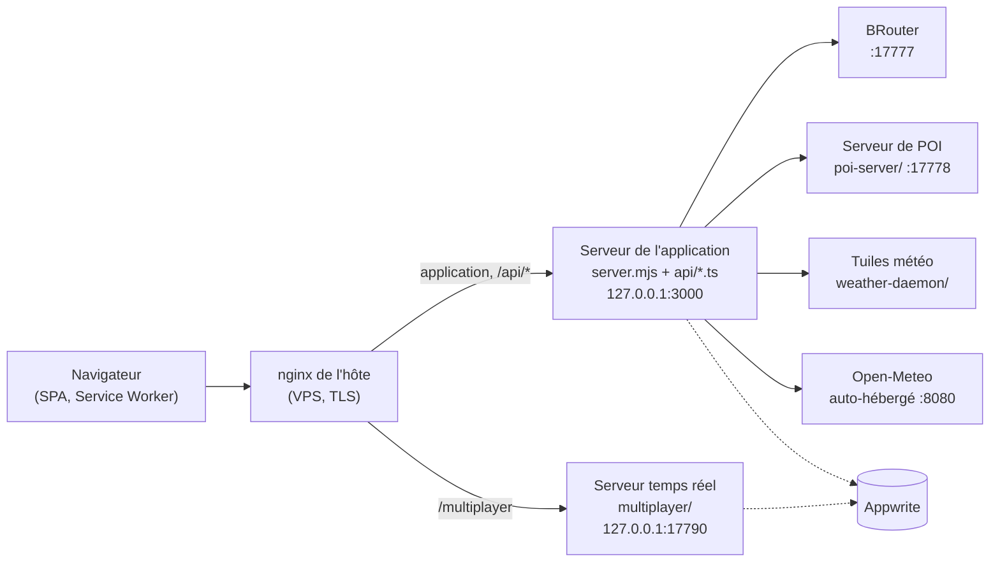

# server/

[← Dépôt](../README.md) · [Index de la documentation](../docs/README.md)

Tout le code côté serveur sauf les gestionnaires de routes HTTP, qui vivent dans
[`api/`](../api). Cela couvre les modules partagés par les deux adaptateurs HTTP,
le serveur de co-édition en temps réel, les services qui tournent sur le VPS et
la configuration de l'hôte du VPS.

## Comment les éléments tournent

- **Production :** [`../server.mjs`](../server.mjs) sert `dist/` et les gestionnaires `api/*.ts`.
  Dans l'image, il tourne sous forme de bundle esbuild dans `dist-server/`.
- **Développement :** les mêmes gestionnaires tournent dans Vite (`redviewDevApiPlugin`
  dans [`vite.config.ts`](../vite.config.ts)).
- Les deux adaptateurs partagent les modules de [`lib/`](lib). Une règle qui
  s'applique aux deux y est écrite une fois, jamais dans chaque adaptateur.

## Dossiers

| Dossier | Ce que c'est | Où il tourne |
|---|---|---|
| [`lib/`](lib) | Modules partagés par les deux adaptateurs HTTP, les gestionnaires d'API et le serveur temps réel. Voir [les modules de `lib/`](#modules-de-lib) ci-dessous. Les tests sont dans [`lib/__tests__/`](lib/__tests__). | Bundlé dans `dist-server/` (image de l'application) et `dist-server/multiplayer.mjs` |
| [`multiplayer/`](multiplayer) | Serveur de co-édition en temps réel : WebSocket, journal, points de reprise, validation fantôme. Son moteur est [`src/features/collab`](../src/features/collab). | Son propre service Coolify, construit depuis [`Dockerfile.multiplayer`](../Dockerfile.multiplayer) |
| [`poi-server/`](poi-server) | Service de POI (Fastify + SQLite R\*Tree), avec son propre `package.json` | VPS, derrière nginx, joint via [`api/poi.ts`](../api/poi.ts) |
| [`poi-ingest/`](poi-ingest) | Construit la base de POI (OSM, relations, Overture, ATP, SIRENE) et la met en service | VPS ou poste de travail, hors ligne |
| [`weather-daemon/`](weather-daemon) | Ingestion GRIB et serveur de tuiles météo : Python, unités systemd, configuration nginx | VPS |
| [`vps/`](vps) | Configuration versionnée de l'hôte : unités et compléments systemd, nginx, sysctl, journald, Docker, surcharge Appwrite, Open-Meteo, Umami, surveillance des services, sauvegardes. Voir son [README](vps/README.md). | Hôte du VPS |

### Modules de `lib/`

| Module | Rôle |
|---|---|
| [`http-security.mjs`](lib/http-security.mjs) | Normalisation des chemins, résolution des routes `/api`, limites de taille des corps, IP du client et clés de limitation de débit, validation des coordonnées de tuiles, listes blanches des services amont |
| [`csp.mjs`](lib/csp.mjs) | La Content-Security-Policy des pages HTML et des scripts de worker. Chaque nouvel hôte externe auquel parle le navigateur va ici. |
| [`api-request.mjs`](lib/api-request.mjs) | Décode `req.query` et `req.body` de la même façon dans les deux adaptateurs |
| [`api-compression.mjs`](lib/api-compression.mjs), [`static-compression.mjs`](lib/static-compression.mjs) | Compression des réponses d'API à l'exécution et des fichiers statiques au build |
| [`request-logging.mjs`](lib/request-logging.mjs), [`observability.mjs`](lib/observability.mjs) | Une ligne de journal JSON par requête ; erreurs envoyées à GlitchTip, nettoyées |
| [`build-id.mjs`](lib/build-id.mjs) | La source unique de l'identifiant de build (application, sourcemaps, release serveur) |
| [`project-access.mjs`](lib/project-access.mjs) | Droits du propriétaire et de l'équipe sur un projet, utilisés par l'API et le serveur temps réel |
| [`byte-lru.mjs`](lib/byte-lru.mjs), [`oldest-key.mjs`](lib/oldest-key.mjs) | Caches bornés en octets ; éviction peu coûteuse de la clé la plus ancienne |
| [`tile-fallbacks.mjs`](lib/tile-fallbacks.mjs), [`terrain-tiles.mjs`](lib/terrain-tiles.mjs), [`radar-recolor.mjs`](lib/radar-recolor.mjs) | Réponses côté serveur pour les familles de tuiles quand le Service Worker est absent |

## Règles pour chaque module d'ici

Ces règles sont détaillées dans [`CLAUDE.md`](../CLAUDE.md).

- **Mémoire bornée.** Chaque cache en mémoire est borné en octets avec
  `lib/byte-lru.mjs`. Les conteneurs ont des limites de mémoire.
- **Un seul endroit pour les règles de requête.** La forme des requêtes et les
  règles de sécurité vivent dans `lib/http-security.mjs`, jamais dans chaque adaptateur.
- **Les droits viennent du serveur seulement.** Les droits sur un projet viennent de
  `lib/project-access.mjs`. Jamais des attributs écrits par le client
  (`user_id`, `team_id`, `collab`, `data`).
- **Nouvel hôte externe ?** L'ajouter à `lib/csp.mjs`, sinon le navigateur le bloquera.
- **Tests.** Les tests serveur sont dans `lib/__tests__/` et à côté des modules de
  `multiplayer/`. Ils tournent avec le reste de `npm run test`.
